# Folkestone-Dogs
 
See the live version of Folkestone Dogs, here: [Folkestone Dogs Deployed site](https://tstyer.github.io/Folkestone-Dogs/)

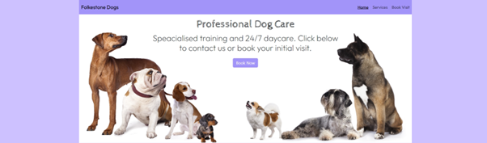

## Table of Contents

1. [Introduction](#introduction)
2. [User Experience (UX)](#user-experience-ux)
   - [Project Scope](#project-scope)
   - [Demographics](#demographics)
   - [User Requirements/Expectations](#user-requirementsexpectations)
   - [User Stories](#user-stories)
     - [Target User Goals](#target-user-goals)
     - [First-Time Visitors](#first-time-visitors)
     - [Returning Visitors](#returning-visitors)
   - [Site Owner Goals](#site-owner-goals)
3. [Features](#features)
   - [Navigation Bar](#navigation-bar)
   - [Home Page](#home-page)
   - [Footer](#footer)
   - [Services Page](#services-page)
   - [Book Now Page](#book-now-page)
   - [Success Page](#success-page)
4. [Design](#design)
   - [Colour Scheme](#colour-scheme)
   - [Typography](#typography)
   - [Imagery](#imagery)
   - [Wireframes](#wireframes)
   - [Features to Implement](#features-to-implement)
5. [Technologies Used](#technologies-used)
6. [Deployment](#deployment)
   - [Deploying to GitHub Pages](#deploying-to-github-pages)
   - [Making a Local Clone](#making-a-local-clone)
7. [Testing](#testing)
   - [Client Stories](#client-stories)
   - [HTML Validation](#html-validation)
   - [CSS Validation](#css-validation)
   - [Lighthouse](#lighthouse)
   - [Manual Testing](#manual-testing)
   - [Responsiveness](#responsiveness)
   - [Browser Compatibility](#browser-compatibility)
8. [Bugs](#bugs)
9. [Validation Errors](#validation-errors)
10. [Image Testing](#image-testing)
11. [Credits](#credits)
    - [Media](#media)
    - [Icons](#icons)
    - [Google Maps](#google-maps)
    - [Code](#code)
    - [Colours](#colours)
12. [Conclusion](#conclusion)

## Introduction

Welcome to the Folkestone Dogs project.

This is a simple, responsive website built using HTML, CSS and Bootstrap. It serves as a foundation for the small (fictional) business, local to the Folkestone, Kent area. They specialise in daycare and training services for dogs of all breeds. The structure of the site is clean, minimal and consistent.

## User Experience (UX)

### Project Scope

The goal for the 'Folkestone Dogs' website is to show prospective clients that they are the best option for dog daycare and training in the area. It offers this through easy navigation, understandable text, and an intuitive layout. 

### Demographics

The main users of the site will be couples who have recently adopted or purchased a new dog. They will ideally be located in the Folkestone area, but likely clients will come from the whole of Kent. 
There is no particular age, but the majority will likely be late-20's to mid-40's, men and women. 

### User Requirements/Expectations

1. Immediately what Folkestone Dogs do in the header and subheads of the homepage.
2. Provide service information on the homepage.
3. Address safety concerns by giving social proof and qualifications.
4. An easy to navigate website that is consistent.
5. See clear and understandable information.
6. See contact details throughout.
7. Offer responsiveness for mobile, tablet, desktop and interaction when hovering over links.

### User Stories

#### Target User Goals

The goal for the target user will be to learn who Folkestone Dogs are, what makes them unique, why they should book their initial visit with the company, and then to proceed with a booking. 
They will be searching for a local business that can offer training and/or daycare services 7 days per week, 365 days per year. 
They'll be looking for reliability in the business by different means, and to find their contact information easily. 

#### First-Time Visitors

1. As a first-time visitor, I want to see why I should choose Folkestone dogs over another business.
2. As a first time visitor, I want to read about their services, experience and qualifications on the first page.
3. As a first-time visitor, I want to easily navigate to any contact information or page.
4. As a first-time visitor, I want to see where the business is located.

#### As a Returning Visitor

1. As a returning visitor, I want to easily navigate to their contact/booking page.
2. As a returning visitor, I want to easily find their social media links to see their social proof with current clients.
3. As a returning visitor, I want to see compelling images.
4. As a returning visitor, I'd like to easily access and navigate the site via a mobile or tablet. 

### Site Owner Goals

My goals for Folkestone Dogs are to create an engaging and user-friendly site that appeals to the desires of the target audience. The goal will be to showcase the reliability of the business
through simple and clean descriptions that stand out from their background. 

Other Sit Owner Goals:
- To boost online bookings by inspiring the reader.
- To build trust with potential future clients via social proof, achievements, images and descriptions.
- To increase daycare benefits by emphasising socialising, behaviour, exercise benefits.
- To increase social media following by easily discoverable links.
- To offer a clear contact form and clearly display a 'Success' page once submitted.

## Features

### Nav. Bar

The navigation bar in the website is consistent across all web pages and has a responsive design with colour-changing feedback. 

The nav. bar:

- Includes links to all the essential web pages, except the success.html page.
- Includes a responsive, colour change to white when you hover over the links.
- Underlines the current page you are on.
- Features #A294F9 colour throughout.
- Has a sticky design, keeping it at the top.
- Features a logo on the left.
- The navigation was implemented from Bootstrap and then heavily modified. 

### Home Page

Here are brief points that describe the homepage (index.html)

- Is presented to offer the most information, without being overbearing.
- It describes the business' purpose in the header, sub header and first paragraphs.
- It features a hero image that is friendly and captivating.
- It has a CTA of 'Book Now' which opens a page to book (or contact) the business.
- It features colours #F5EFFF, #E5D9F2 and white.
- There are modified images to appear friendly and show dogs enjoying themselves.
- There is a modified carousel at the bottom, which hides the images, only showing the text that is displayed. 
- The 'Learn More' buttons are implemented from Bootstrap and modified. 

### Footer 

Brief points on the footer:

- Features a colour of #A294F9.
- Includes links to social media.
- Displays useful contact information on every page.
- Offers a responsive, colour-changing design.
- Offers a link to 'Go Back Home' when on any other page (except index.html).
- Features a copyright notice at the bottom of the footer to display ownership and year. 

### Services Page

Brief points on the services.html page:

- Like all pages (except succes.html), there is an eye-catching hero image.
- There is a 'Book Now' CTA at the bottom of the page, offering the same features as the others.
- Includes detailed descriptions of the services and what the benefits are.
- Includes the footer.

### Book Now Page

Brief points on the booking.html page:

- Displays another captivating hero image.
- The subheading is concise and to the point.
- Features a form that requires fields to be filled out before submitting.
- Includes an interactive map of where the business operates. 

### Success Page

Brief points on the success.html page:

- This page is only accessed once the form above is filled out and submitted.
- There is not her image.
- There is a single, medium-sized image of which is positive and in tone.
- There is a simple message, displayed in the constant font throughout.

## Design

### Colour Scheme

The palette of colours were chosen after doing a little research to find which would represent a trustworthy and friendly brand.
The variations of light blue reflect the calmness and welcoming tone of the business and what they stand for. The palette was discovered using 
Color Hunt. [Here is the exact link](https://colorhunt.co/palette/f5efffe5d9f2cdc1ffa294f9) to the palette.

The colours mainly used were:

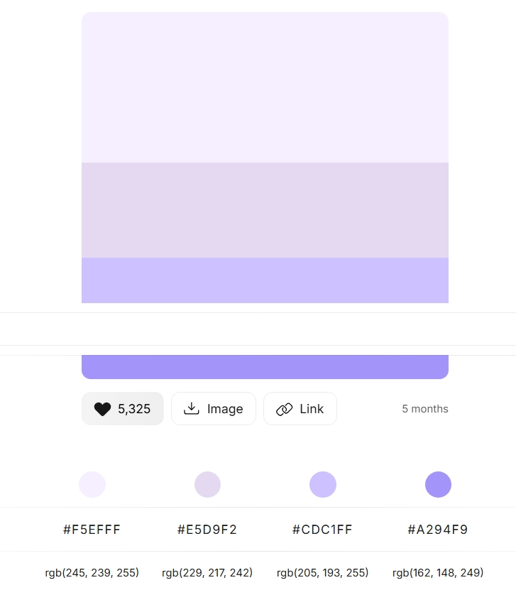

### Typography 

Text was written in fonts taken from 'Google Fonts':

- Header Font: The font used for all headers was 'Cabin Sketch'.
  This font was consistent with the brand tone (friendly, calm, playful).

- Paragraph Font: The font for regular text is 'Outfit', which is also calm but contrasting to the header font.

### Imagery 

- All images were sources from [Dreamstime](https://www.dreamstime.com/?gad_source=1&gad_campaignid=22463944440&gbraid=0AAAAA_ZeP4BR30TPCyxZl7KqV3DrTOPEC&gclid=Cj0KCQjwxJvBBhDuARIsAGUgNfjWCeCw3mx6ZqAVDyNDhsNlTlGrZAGthEoQVywDaRvWlPoYwbvHWUgaAuIaEALw_wcB#res56964943)
- The contact/booking page includes a map, where code was taken from Google and implemented.

### Wire Frames 

Mock-ups of the home page, services and booking page were created using Balsamiq. They were created for mobiles, tablets and desktops. 

All wire frames will be found here:

- [Wireframes](https://balsamiq.cloud/sb2mrbr/ppikq61/rA886)

### Features to Implement

In the future, I want to implement Java Script and create more pages for the site. 
The goal is to use it as a template to improve my front-end ability. 

## Technologies Used

### Development Tools

- HTML5: For the mark-up language. 

- CSS3: for styling

- VS Code: Local IDE to commit and push changes once made. 

- Balsamiq: Used to create blueprints or wire frames.

- Github: To host my code.

- Bootstrap 5.3: For implementing pre-built code that is responsive.

- Font Awesomne: For Fav Icons and Social Icons. 

- Dreamstime: Used for all images. 

- Google Fonts: Used for all fonts.

- Color Hunt: Used for all the colours on the site. 

- W3C: Used to scan the HTML and CSS code for validation. 

- Google Chrome Lighthouse: For accessibility, SEO, responsiveness and best practices.

## Deployment 

### Deplying to Github Pages

This website was developed in VS code and deployed to Github pages. 

To deploy this site, follow these steps:

1. You must first navigate to the repository [here](https://github.com/tstyer/Folkestone-Dogs)
2. Then, you will need to click on the 'settings' button.
3. From there, navigate to the 'pages' button.
4. Under 'Source', click the drop-down menu.
5. Select 'Main', and click 'Save'.
6. Once 'Main' has been selected and saved, a message will appear saying that 'Your site has been published'.

The live site can be found [here](https://tstyer.github.io/Folkestone-Dogs/)

### Making a Local Clone

You can create a local repository by cloning this one. Any changes you make to the local copy will not affect the original one. 

Here are the steps to follow:

1. Log in to your GitHub account and navigate to my profile (tstyer).

2. Open the ‘Folkestone Dogs’ repository.

3. Click the green Code button near the top right of the repository page.

4. In the drop-down, copy the HTTPS URL.

5. Open Visual Studio Code.

6. Click the Source Control icon (or press Ctrl+Shift+G / Cmd+Shift+G).

7. Click Clone Repository (or press F1, then search and select "Git: Clone").

8. When prompted, paste the copied repository URL into the input box at the top.

9. Choose a folder on your local machine where you want the repository to be saved.

10. Once cloning is complete, VS Code will ask if you want to open the repository in a new window. Select Yes or Open in a New Window.

## Testing

### Client Stories 

1. "As a user, I want a user-friendly experience when navigating the website."

   a. The navigation is clean and simple. There is also a further ‘Back to Home’ button at the bottom of every page, so the user doesn’t have to scroll back up. 

   b. The navigation is consistent across all pages and easy to understand.

2. “As a user, I want to see social proof and testimonials of other users who have had a great experience with Folkestone Dogs.”

   a. There is a carousel at the bottom of the home page that shows customer reviews.

3. “As a user, I want to experience a simple and intuitive layout that makes it easy to find the information I am looking for.”

   a. The subheadings are clear and distinguishable from the other content.

   b. Pictures and content are consistent, but not overwhelming.

   c. Headings and subheadings display an underline when hovered over.

4. “As a user, I want to read engaging but simple descriptions that describe the benefits of each service.”

   a. All the descriptions are clear and simple.

   b. They are easy to understand, and adhere to the main desires of the target audience.

5. “As a user, I want to find the contact details easily if I have any additional questions.”

   a. Throughout the website, there are links (‘Book’) to the book/contact page. This is clearly stated in the subheading.

   b. The footer is constant, with a message that welcomes the user to send them a message or call the company if they have questions.

6. “As a user, I want to find the booking form easily, so that I can book the specific service I am interested in.”

   a. The booking form is easily found if you navigate from any of the pages.

   b. Clear instructions lead the user to the booking from the other pages.

7. “As a small business, I would like to easily find information that states if they can support my requirements for plenty of dogs.”

    a. The services section clearly states that the business can support plenty of dogs and meet the requirements of other businesses.

8. “As a small business, I would like to see if they are qualified by professional bodies and if they have plenty of experience.”

    a. The homepage clearly advertises their insurance and their professional qualifications and experience.

### HTML Validation 

The HTML of all the pages was validated through the [W3C Validator](https://validator.w3.org/#validate_by_input)

#### index.html 

No errors or warnings to show:

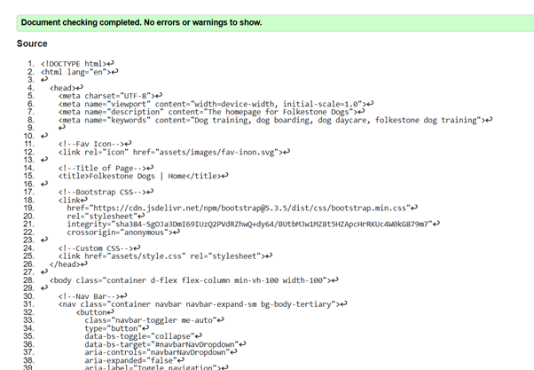

#### booking.html 

No errors or warnings to show:

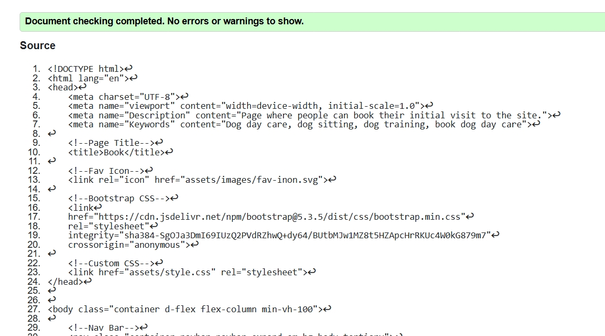

#### services.html

No errors or warnings to show:

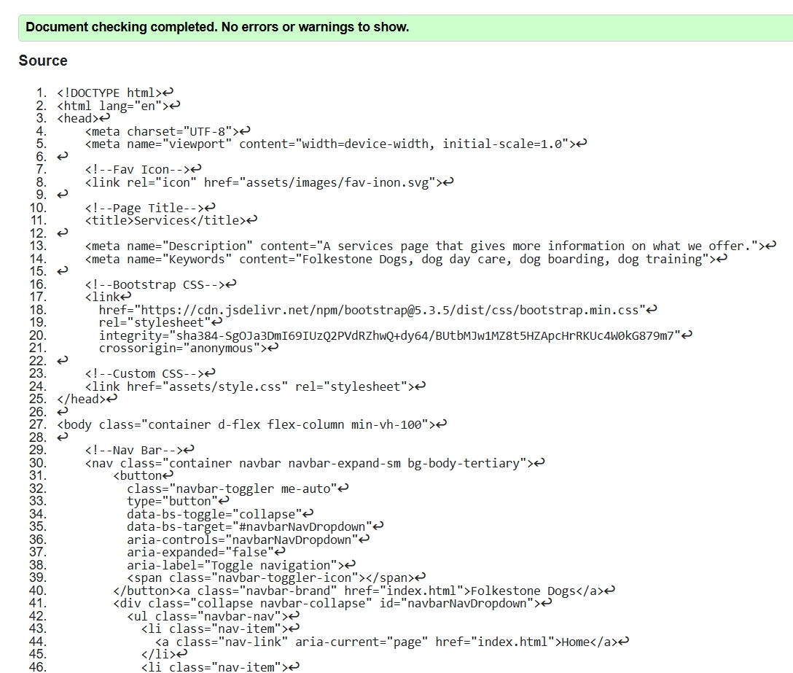

#### success.html 

No errors or warnings to show:

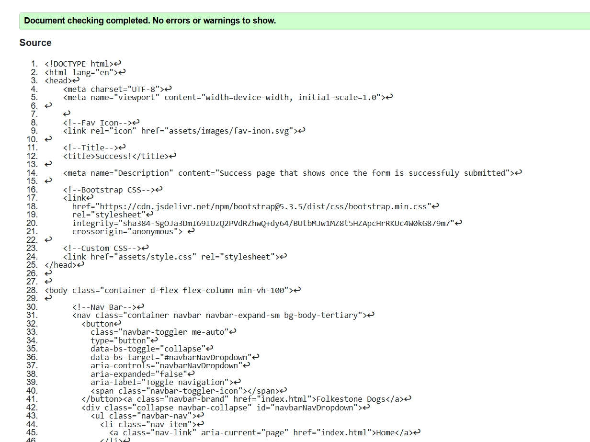

### CSS Validation

No errors or warnings to show:

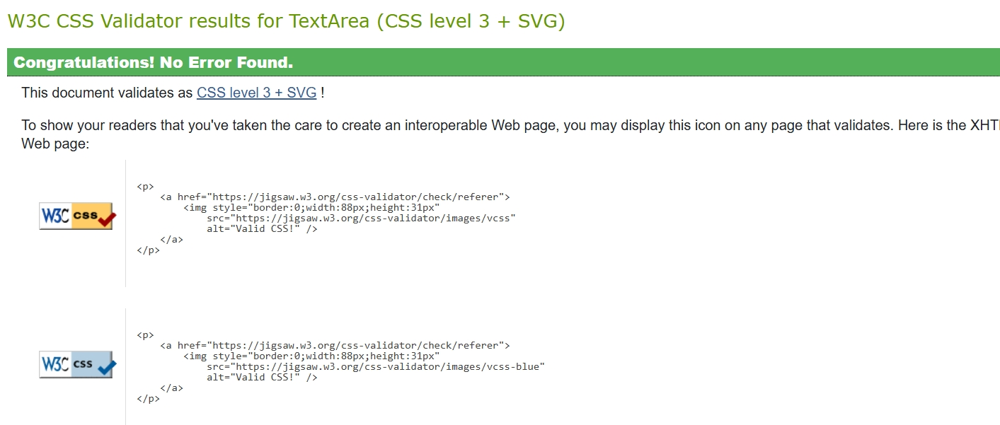

### Lighthouse

I had done testing with Lighthouse throughout the project to ensure users have the best experience. After the initial tests on all pages, I spoke with tutors and it was clear that
I needed to decrease imager sizes and minimise CSS. 

However, having completed the recommended tasks, the results were still not optimal. I have noted this, and so in the future I will learn how to achieve optimal performance and update this website as I continue my learning. 

See the latest results, below:

#### index.html

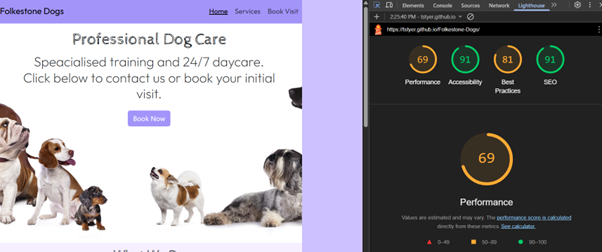

#### success.html

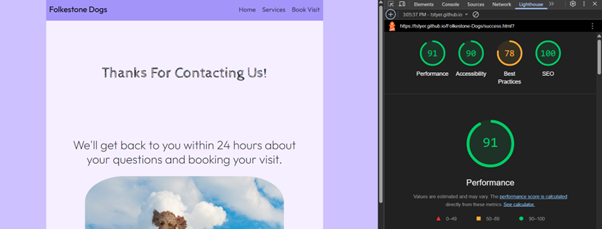

#### services.html

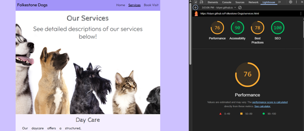

#### booking.html

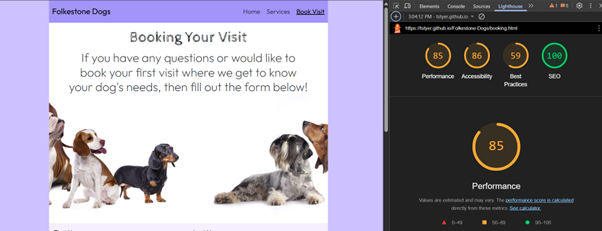

### Manual Testing

| Feature                | Expected Outcome                                                  | Testing Performed                                   | Result                                                                 | Pass/Fail |
|------------------------|-------------------------------------------------------------------|-----------------------------------------------------|------------------------------------------------------------------------|-----------|
| Nav. Bar Links         | When clicked, they open the correct pages.                       | Clicked on Navigation links.                        | They all work as expected, sending the user to the dedicated page.     | Pass      |
| Hamburger Menu         | When clicked, it shows the links on the left.                    | Clicked on hamburger icon.                          | The drop-down worked as expected.                                       | Pass      |
| Book Now Button        | Once clicked, it routes to the booking page.                     | Clicked on the 'Book now' button on all pages.      | All buttons take you to the booking page successfully.                 | Pass      |
| Links (Various)        | Can change to white when hovering on links.                         | Hovered over every link on every page.              | They all change to white successfully.                                 | Pass      |
| Contact/Booking Forms  | Can only be submitted when required fields are filled.               | Filled in required fields and tried to submit.      | The form required mandatory fields to submit.                          | Pass      |
| Responsive Testing     | The page looks usable on mobile, tablets and desktops.           | Opened the site/pages on desktop and mobile.        | The page loaded and scaled nicely across devices.                      | Pass      |
| Footer Social Links    | Each link goes to the correct page.                              | Clicked on each link.                               | Each link takes you to correct pages.                                  | Pass      |
| Other Footer Links     | Navigate links open when opened.                                 | Clicked on each link.                               | Each link goes to the correct information.                             | Pass      |
| Contact Section Data   | The content (details and phone) shows on each page.               | Opened each page to check.                          | Each page shows the contact details.                                   | Pass      |
| Learn More Buttons     | Buttons take you to Services/More Info when clicked.             | Clicked on each button.                             | Each Learn More button opens Services.html.                            | Pass      |
| Images Load Efficiently| The images load instantly.                                       | Opened each page to check.                          | Each picture loads instantly.                                          | Pass      |
| Overall UX             | Smooth experience with everything working.                       | Clicked on each page and ensured everything works.  | Each page is consistent and works as expected.                         | Pass      |

These user tests confirm the website is fully functional and user-friendly, providing a seamless experience for visitors.

### Responsiveness

The website was tested on Microsoft Edge, Chrome, Firefox and Internet Explorer across different sizes for responsiveness.

Mobiles: 

- Mobiles: 320px (Max)
- iPhone SE

Tablets:

- iPad Air
- iPad Pro

Desktops:

- Laptop (1024px's +)
- Desktop (1440px's +)

### Browser Compatability

The website was tested on Microsoft Edge, Chrome, Internet Explorer, and Firefox and works as expected. 

## Bugs

### Carousel Not Displaying Text

Issue: When first implementing the carousel, the paragraph text did not show on smaller screens.
Fix: Added a media query that shrinks the font size to smaller.

### Homepage Images Uneaven

Issue: displaying the homepage on tablet sizes created an uneven image display. 
Fix: Changed the display to Flex, added space-between, flex-grow to 1, and flex-direction of column.

### Missing Alt Text

Issue: The images on the homepage had missing alt text.
Fix: Added alt tags and included the text.

### Uneven Footer Elements

Issue: The footer displayed uneven links at the full size and smaller sizes. 
Fix: Ensured the padding-top was at 5px for all top-level links and items were aligned to the centre. 

### Map Display Was Too Small

Issue: The map on the booking page was too narrow. 
Fix: By selecting it in CSS, I set the width to 100%. 

### Navigation Bar Burger 

Issue: Nav. Bar displaying on the wrong side (right) when screen size minimised. 
Fix: This was due to the placement of the anchor tag (Folkestone Dogs). I moved it next to the end of the buttons closing tag.

## Validation Errors

### HTML

#### Sections

The use of sections was flagged when there was no use of headings. Thus, I removed the section to replace it with div's. 

#### Improper Closing tags

Self-closing elements included forward slashed, so I removed them as suggested. 

### CSS

#### ID's

Too many ID's were used, then removed as suggested. 

## Image Testing

After running Lighthouse, the images were clearly marked, and I learned they were far too large. I then downloaded smaller versions. 

## Credits

A list of all the resources that were outsourced will be displayed here. 

### Media

#### Images

- Dogs running in a park, by aglphotoproductions. Found at [here](https://www.dreamstime.com/royalty-free-stock-photos-little-dogs-park-image25207288).  
- Trainer with dogs, by Filipp o Romeo. Found [here](https://www.dreamstime.com/royalty-free-stock-images-dog-trainer-teaching-dogs-group-listen-to-commands-image32812229). 
- ‘Booking image header’, by Lilun. Found [here](https://www.dreamstime.com/stock-photo-group-dogs-white-background-standing-looking-up-image88483504). 
- ‘All types of dogs’, by Lilun. Found [here](https://www.dreamstime.com/stock-photo-group-dogs-cats-white-background-standing-looking-up-image88483363). 
- ‘Dogs running’, by Lunja87. Found [here](https://www.dreamstime.com/stock-photo-group-dogs-playing-park-image69809088).
- ‘Dogs Running 2’, by Tamara Bauer. Found [here](https://www.dreamstime.com/royalty-free-stock-photo-running-dogs-image19923945).
- ‘Services header 2’, by Lilun. Found [here](https://www.shutterstock.com/image-photo/cat-dog-group-dogs-kitten-looking-195226160).
- ‘Services header image’, by Lilun. Found [here](https://www.dreamstime.com/stock-photo-group-dogs-cats-white-background-standing-looking-up-image88483363).
- ‘Success page image’, by Cammeraydave. Found [here](https://www.dreamstime.com/royalty-free-stock-images-dogs-dog-park-training-image4492729).

#### Icons

All icons were implemented using Font Awesome. You can find the link to Font Awesome [here](https://fontawesome.com/)

### Google Maps

I had sourced the map directly from Google, after finding a familiar location. I simply clicked on 'Share' within Google Maps, and imported the code from there. 

### Code

The majority of the code is original, but some of which had been supplemented with Bootstrap. All of which had been heavily modified to suit the structure and colour of Folkestone Dogs. 

Here are links to the Bootstrap templates used:

- [Navigation](https://getbootstrap.com/docs/5.3/components/navbar/)
- [Carousel](https://getbootstrap.com/docs/5.3/components/carousel/)
- [Form](https://getbootstrap.com/docs/5.3/forms/overview/#overview)

#### Boostrap

Code imported from Bootstrap:

1. Some buttons.

2. Booking/Contact form.

3. Navigation Bar.

4. Carousel.

### Colours

All colours were imported from Color Hunt. You can find a link to Color Hunt [here](https://colorhunt.co/)

## Conclusion

This project was a steep learning curve, and I thoroughly enjoyed the process. It also helped me understand my passion for front-end development, and is what I will pursue moving forward. 

I have learned about areas of improvement, and will implement changes to this website as I progress. 

Help from tutors, and my mentor was second-to-none, and this makes me feel confident going into the next projects. 

